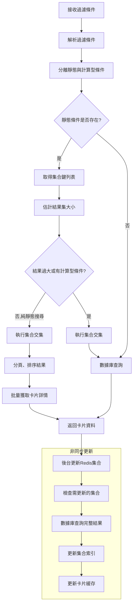

# 卡片查詢快取機制規劃文件

## 流程描述

卡片過濾查詢系統使用Redis集合和鍵值對儲存來實現高效的多條件查詢，同時考慮卡片更新和多值特徵情況。系統採用漸進式擴充快取的方式，確保查詢性能和快取完整性。

### 基本查詢流程

### 卡片資料更新流程

## 詳細實作說明

### 1. 集合設計與命名規則

每個特徵建立一個集合，集合鍵命名規則：

- `set:{特徵名稱}:{特徵值}` - 例如 `set:type:怪獸`、`set:attribute:光`
- 集合成員為 `id:number` 格式的卡片複合鍵

### 2. 複合鍵設計

### 3. 靜態與計算型過濾器

過濾條件分為兩類：

- **靜態條件**：可直接映射到Redis集合的條件（如類型、種族、屬性）
- **計算型條件**：需要數據庫處理的條件（如文本搜尋、數值範圍）

### 4. 高效查詢策略

1. **集合交集為主**：優先使用Redis的SINTER操作獲取符合靜態條件的卡片ID
2. **混合查詢**：
   - 靜態條件預先過濾
   - 計算型條件使用MongoDB處理（包括全文檢索）
3. **結果集大小估算**：
   - 根據最小集合大小評估交集效率
   - 大於閾值（如2000）時直接使用數據庫查詢

## 漸進式優化機制

系統採用回應優先、背景更新的漸進式優化策略：

1. **優先回應查詢**：使用現有快取或數據庫立即回應請求
2. **後台擴充索引**：
   - 記錄靜態條件對應的集合鍵
   - 檢查過期（超過24小時）或不存在的集合
   - 非同步查詢數據庫並更新Redis集合
3. **避免重複更新**：使用時間戳記錄集合最後更新時間

## 過期策略

- **基本設定**：集合和卡片詳情設置7天過期時間
- **差異化過期**：根據數據重要性和變化頻率調整TTL
- **自動更新**：集合過期或不存在時自動觸發後台更新

## 性能優化技術

1. **批量操作**：
   - 使用 MGET/MSET 批量讀寫卡片詳情
   - 使用 SADD 批量更新集合成員
2. **排序與分頁**：
   - 對集合交集結果進行標準化排序
   - 只傳輸當前頁面所需的數據
3. **熱點數據優先**：根據查詢頻率調整索引更新優先級

## 特殊情況處理

1. **複合條件查詢**：
   - 結合模糊搜尋與集合過濾
   - 使用 Atlas Search 處理文本查詢
2. **禁限卡處理**：
   - 支持複雜的卡片編號模式匹配
   - 使用正則表達式處理部分匹配

透過以上機制，系統能在保持查詢響應速度的同時，不斷擴充和完善快取資料，提供高效且準確的卡片查詢服務。
