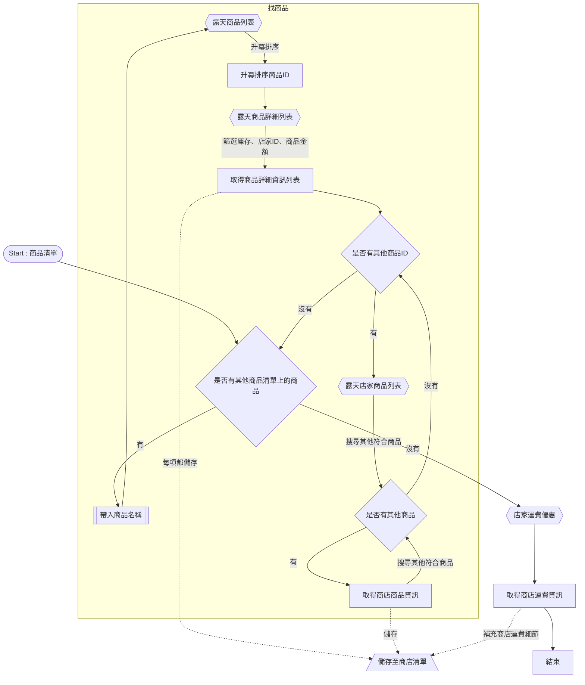

# 卡片購買最佳解 - 露天商店購買流程

為解決當有許多卡片(數量不一時)想要購買，但要考慮運費、各家商店庫存、及間賣場的目標價格等因素，希望能夠透過一個 `script function` 解決此問題，後續可整合至 `libs` ，以供 `後端` API 使用

## 流程規劃

1. 為了取得各賣場的 `目標卡片價格`、`卡片庫存`、`運送方法、運費及免運門檻`、`目標網址` 等內容，需透過許多多隻 API 組合達成
2. 當取得以上資訊後，透過 `GetShopsInfoByRutenService` 整合上述 API 資料，並取得有關的 `店家與卡片相關資訊`
3. 透過 `BestPlanByRutenService` 取得最佳運送方案，並且回傳詳細內容

## 步驟細節

### 所使用 API 資料

#### 露天商品列表

```
https://rtapi.ruten.com.tw/api/search/v3/index.php/core/prod?q=${搜尋字串}&type=direct&sort=prc%2Fac&offset=1&limit=100

```

- 可取得該商品最便宜的 `商品 ID`(Rows[].Id)

#### 露天商品詳細列表

```
https://rapi.ruten.com.tw/api/items/v2/list?gno=${商品 ID}&level=simple

```

- 商品 ID 可透過 ',' 取得多筆資料
- 可取得該商品的 `庫存`(data[].num)、`店家 ID`(data[].user)、 `商品金額`(data[].goods_price)
- 可透過篩取 : `幣別`(data[].currency) => `TWD` 以外排除、 `名稱`(data[].name) => 按照`金額爬蟲篩選器`邏輯排除、`庫存`(data[].num) => `庫存不足`排除

### 店家運費優惠

```

https://rapi.ruten.com.tw/api/shippingfee/v1/seller/${店家 ID}/event/discount
```

- 可取得該店家的 `運費優惠`、`免運門檻`、`運送方式`(discount_conditions[運費方式]) : 僅有 `SEVEN`、`FAMILY`、`HILIFE` 為支援的運送方式

#### 露天店家商品列表

```
https://rtapi.ruten.com.tw/api/search/v3/index.php/core/seller/${店家ID}/prod?sort=prc/ac&limit=${最多50}&q=${目標名稱}
```

- 可獲取 此店家所有`商品 ID`(Rows[].Id)

### 重要的 Interface

#### 購買清單(由使用者提供)

```javascript
interface ProductRequest {
  productName: string;
  count: number;
}

```

- `productName` : 商品名稱(${`卡號`+`稀有度`})
- `count` : 商品數量(最多3)

#### 商店與商品清單(由 `getShopsDetailListByRutenService` 取得 )

```javascript
interface Product {
  price: number;
  id: string;
  qtl: number;
}


interface Shop {
  id: string;
  products: Record<string, Product>;
  shipPrices: Record<string, number>;
  freeShip: Record<string, number>;
}
```

- `id` : 店家ID
- `products` : 商品列表，`key` 為商品名稱，`value` 為商品資訊，包含 `price`、`id`、`qtl`
- `shipPrices` : 運費列表，`key` 為運送方式，`value` 為運費
- `freeShip` : 免運門檻列表，`key` 為運送方式，`value` 為免運門檻

#### 運送方式

```javascript
desiredShippingMethod?: string;
```

- `desiredShippingMethod`: 運送方式(`SEVEN`、`FAMILY`、`HILIFE`)

### getShopsDetailListByRutenService 取得商店與商品列表清單

#### 步驟

1. 透過 `露天商品列表` 取得按照價格升冪排序的`商品ID`，並取前 100 筆資料
2. 透過 `露天商品詳細列表` ，並依照篩選規範，取得前10便宜的商品的`庫存`、`店家ID`、`商品金額`，儲存至列表(`Shop`格式)
3. 針對每一個商品的商品店家(透過`店家ID`)，透過`露天店家商品列表` 查看是否有其他商品清單上的商品(搭配`露天商品詳細列表`)，並儲存至列表(`Shop`格式)
4. 最後將獲得一個`Shop[]`列表，包含搜尋的商店及該商店符合購買清單的商品資訊
5. 透過查詢每家商店的`店家運費優惠`，填入`shipPrices`及`freeShip`資訊

- 流程圖如下 :



### BestPlanByRutenService 取得最佳運送方案

- 帶入下列參數 :

  - 商店與商品清單(`Shop[]`)
  - 購買清單(`ProductRequest[]`)
  - 運送方式?(`string`) : `SEVEN`、`FAMILY`、`HILIFE` 為支援的運送方式，若無指定，則以該店最佳優惠為主

- 步驟

  1. 取得每家店家，盡可能可購買之商品及所需數量，並計算需花費金額、最佳運費方式與是否免運
  2. 排除 `notFindProduct`(數量不足商品，需紀錄) 與 `saveProduct`(總量剛好的商品)，剩餘 `difficulty`(總量大於所需量之商品)
  3. 針對 `difficulty` 商品，依照單價排序，選擇最便宜的方式其餘剃除，並計算每家商品總花費，並是否有達到免運門檻
  4. 篩選沒有達到免運門檻的店家，將其所有品項，盡可能對所有商品排列組合，選出包含考量運費下最便宜的方案
  5. 剔除最後沒有商品的商店
  6. 調整每家商店的總消費金額(包含運費)
  7. 取得最佳方案

- 最佳方案的 Interface :

```javascript

interface NotFindProduct {
  productName: string;
  count: number;
}

interface ShopProductDetail {
  productName: string;
  count: number;
  totalCost: number;
  singlePrice: number;
  id: string;
}

interface BestPlan {
  notFindProduct: NotFindProduct[];
  bestPlan: ShopResult[];
  totalSpend: number;
}

```

### 取得購買連結

- 透過 `BestPlan.ShopResult[].id`，搭配`https://www.ruten.com.tw/item/show?${商品ID}`，即可取得商品的購買連結

### 後續

- 看是否可以透過 `puppeteer` 動態爬蟲，將所有商品欲購買的數量加入到購物車中
